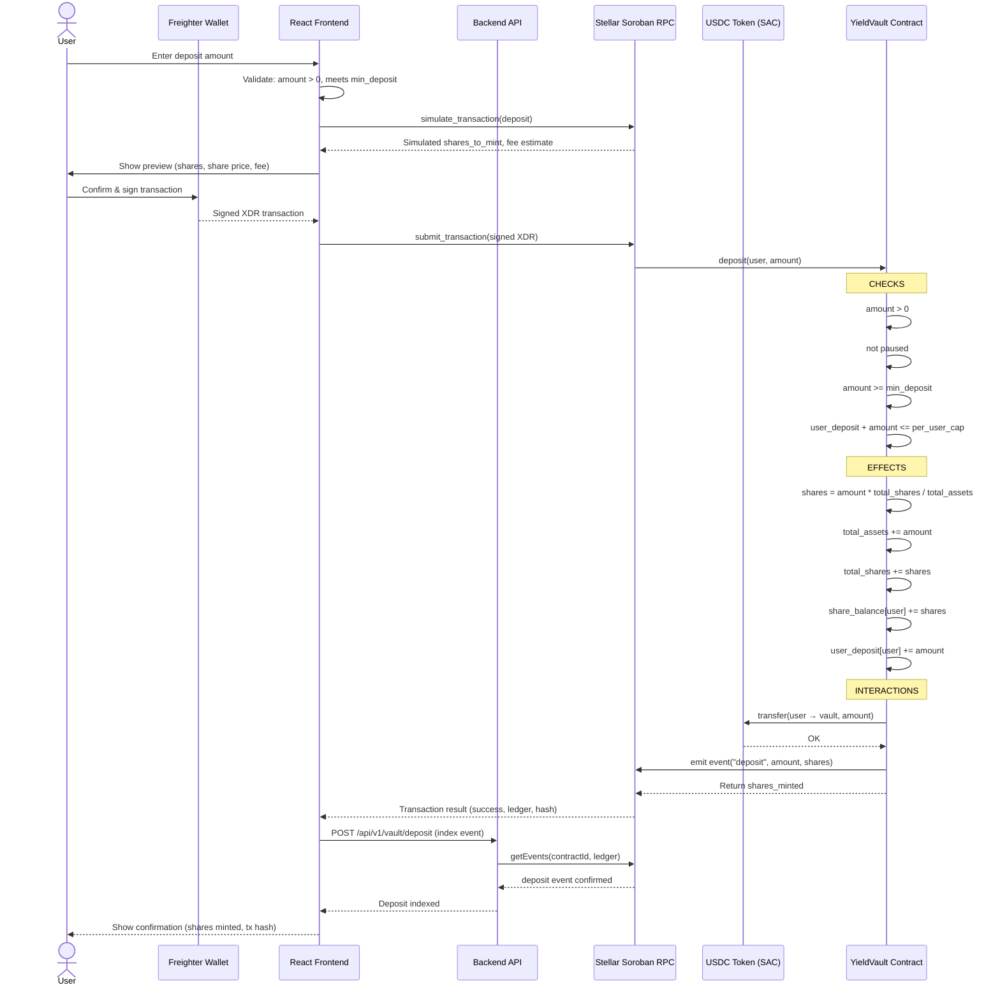
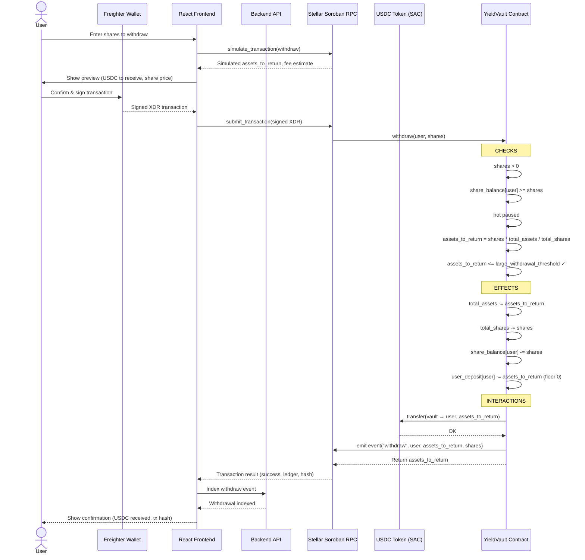
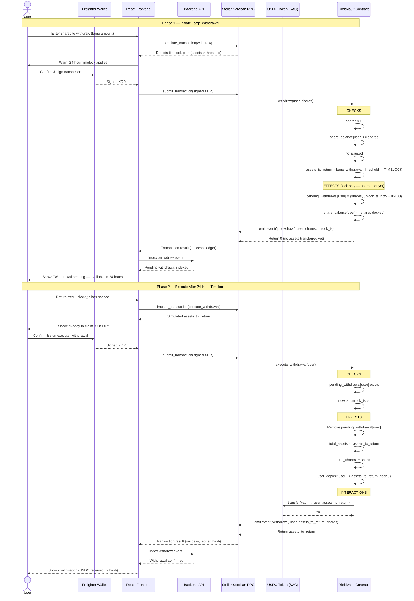

# Vault Deposit & Withdrawal Lifecycle Sequence Diagrams

This document covers the complete request-to-confirmation lifecycle for deposit and withdrawal operations in YieldVault, from the user's wallet interaction through the Soroban smart contract to on-chain confirmation.

---

## Deposit Lifecycle

A deposit moves USDC from the user's wallet into the vault and mints proportional `yvUSDC` shares back to the user.



### Deposit State Transitions

```
IDLE
  │
  ▼ User submits amount
VALIDATING (frontend checks: amount > 0, meets min_deposit, within cap)
  │
  ▼ Simulation passes
AWAITING_SIGNATURE (Freighter prompt shown)
  │
  ▼ User signs
SUBMITTING (XDR sent to Soroban RPC)
  │
  ├─ Contract rejects ──► FAILED
  │   (paused / below min / exceeds cap / zero amount)
  │
  ▼ Contract accepts
CONFIRMING (waiting for ledger close ~5 s)
  │
  ▼ Ledger closes
CONFIRMED
  └─ deposit event emitted on-chain
  └─ yvUSDC shares credited to user
```

### Deposit Error Paths

| Error | VaultError Code | Cause | User Action |
|---|---|---|---|
| `InvalidAmount` | 3 | Amount ≤ 0 | Enter a positive amount |
| `ContractPaused` | 4 | Vault is paused | Wait for admin to unpause |
| `MinDepositNotMet` | 6 | Amount < `min_deposit` | Increase deposit amount |
| `ExceedsUserCap` | 5 | Would exceed per-user cap | Reduce amount |

---

## Withdrawal Lifecycle

Withdrawals have two paths depending on whether the requested amount exceeds the `large_withdrawal_threshold`.

### Path A — Standard Withdrawal (below threshold)



### Path B — Large Withdrawal with 24-Hour Timelock



### Withdrawal State Transitions

```
IDLE
  │
  ▼ User submits shares
VALIDATING (frontend checks: shares > 0, user has balance)
  │
  ▼ Simulation passes
AWAITING_SIGNATURE (Freighter prompt shown)
  │
  ▼ User signs
SUBMITTING (XDR sent to Soroban RPC)
  │
  ├─ Contract rejects ──► FAILED
  │   (paused / insufficient shares / zero amount)
  │
  ├─ assets <= threshold ──► CONFIRMING ──► CONFIRMED
  │                           (~5 s ledger close)   └─ withdraw event emitted
  │                                                  └─ USDC transferred to user
  │
  └─ assets > threshold ──► TIMELOCK_PENDING
                              └─ pndwdraw event emitted
                              └─ shares locked in contract
                              │
                              ▼ 24 hours pass
                            TIMELOCK_READY
                              │
                              ▼ User calls execute_withdrawal
                            CONFIRMING ──► CONFIRMED
                                           └─ withdraw event emitted
                                           └─ USDC transferred to user
```

### Withdrawal Error Paths

| Error | VaultError Code | Cause | User Action |
|---|---|---|---|
| `InvalidAmount` | 3 | Shares ≤ 0 | Enter a positive share amount |
| `InsufficientShares` | 2 | User balance < requested shares | Reduce share amount |
| `ContractPaused` | 4 | Vault is paused | Wait for admin to unpause |
| `TimelockNotExpired` | 7 | `execute_withdrawal` called too early | Wait until `unlock_ts` |
| `NoPendingWithdrawal` | 8 | No pending withdrawal exists | Initiate withdrawal first |

---

## Share Price Mechanics

Both deposit and withdrawal use the same share price formula, ensuring fair value exchange at all times.

```
Share Price  =  total_assets / total_shares

Deposit:
  shares_minted  =  amount × total_shares / total_assets
                    (= amount if first deposit, when total_shares = 0)

Withdrawal:
  assets_returned  =  shares × total_assets / total_shares
```

Yield accrual increases `total_assets` without changing `total_shares`, which raises the share price and benefits all depositors proportionally.

---

## Event Reference

| Event | Emitted When | Key Data |
|---|---|---|
| `deposit` | Deposit succeeds | `amount`, `shares_minted` |
| `pndwdraw` | Large withdrawal initiated (timelocked) | `shares`, `unlock_timestamp` |
| `withdraw` | Withdrawal completes (standard or after timelock) | `assets_returned`, `shares_burned` |

See [WEBHOOK_INTEGRATION.md](./WEBHOOK_INTEGRATION.md) for full event schema and consumer examples.

---

## Related Documents

- [Contracts Architecture](./CONTRACTS_ARCHITECTURE.md) — Full contract interface and storage layout
- [Webhook Integration Guide](./WEBHOOK_INTEGRATION.md) — Consuming on-chain events
- [Local Development Quickstart](./LOCAL_DEVELOPMENT_QUICKSTART.md) — Running the stack locally
