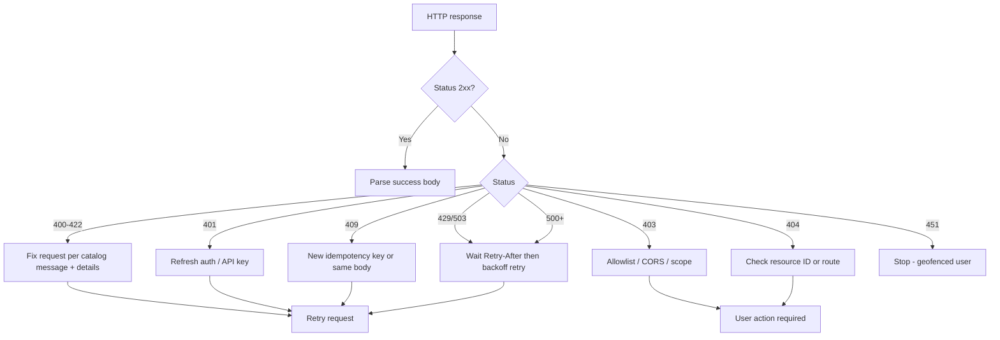

# API Error Code Catalog

This document is the **integrator-facing reference** for YieldVault errors: stable
catalog IDs, HTTP and on-chain codes, example payloads, and **actionable
remediation** steps.

For client-side TypeScript error **shapes** (`ApiError`, `ValidationError`), see
[ERROR_FORMAT.md](./ERROR_FORMAT.md). For pagination failures that surface as
`400 Bad Request`, see [PAGINATION.md](./PAGINATION.md).

> **Note:** REST responses today use the `error` + `status` + `message` triad.
> A formal machine-readable registry on every endpoint is tracked in
> [Issue #571](https://github.com/Junirezz/YieldVault-RWA/issues/571). Catalog
> IDs below (e.g. `API_400_VALIDATION`) are **documentation-stable** identifiers
> for integrators until that work lands.

---

## Table of contents

1. [Error layers](#1-error-layers)
2. [REST error shape](#2-rest-error-shape)
3. [Response headers](#3-response-headers)
4. [REST error catalog](#4-rest-error-catalog)
5. [Soroban contract errors (`VaultError`)](#5-soroban-contract-errors-vaulterror)
6. [Backend Soroban submission codes](#6-backend-soroban-submission-codes)
7. [Frontend client error codes](#7-frontend-client-error-codes)
8. [Integrator decision flow](#8-integrator-decision-flow)
9. [Examples](#9-examples)
10. [Known variations](#10-known-variations)

---

## 1. Error layers

Integrators may encounter errors at three layers:

| Layer | Where | Typical consumer |
|-------|--------|------------------|
| **REST API** | Express backend (`backend/src`) | Mobile apps, dashboards, server-side bots |
| **Soroban contract** | `contracts/vault` on Stellar | Wallets, indexers, direct RPC callers |
| **Frontend client** | `frontend/src/lib/api` | Web app using shared TS helpers |

Handle REST and contract layers independently: a `200` from the API does not
guarantee an on-chain transaction succeeded until you confirm the ledger entry.

---

## 2. REST error shape

### Canonical shape (preferred)

Most endpoints return JSON with at least:

```json
{
  "error": "Bad Request",
  "status": 400,
  "message": "Human-readable explanation"
}
```

Optional fields depend on the scenario (see catalog). The `error` field is a
short **category label** (often mirroring the HTTP reason phrase). The `message`
field carries **actionable detail**.

### Minimal shape (legacy / admin helpers)

Some admin routes return only:

```json
{ "error": "Missing or invalid walletAddress in request body" }
```

Treat missing `status` as implied by the HTTP response code. Prefer migrating
callers to the canonical shape when building new integrations.

---

## 3. Response headers

| Header | When present | Integrator action |
|--------|----------------|-------------------|
| `X-Correlation-ID` | Most API responses (middleware) | Log with support tickets |
| `Retry-After` | `429`, `503` (rate limit, maintenance, circuit breaker) | Wait N seconds before retry |
| `idempotency-status: replayed` | Vault deposit/withdraw when `Idempotency-Key` matches a prior success | Safe to treat as success; do not double-submit on-chain |
| `Authorization` (request) | Protected routes | `Bearer <jwt>` or `ApiKey <key>` per endpoint docs |

---

## 4. REST error catalog

### 4.1 Client errors (4xx)

| Catalog ID | HTTP | `error` | Typical `message` / trigger | Remediation | Retry? |
|------------|------|---------|----------------------------|-------------|--------|
| `API_400_VALIDATION` | 400 | `Bad Request` | Zod validation failed (`validate` middleware); includes `details[]` with `{ field, message }` | Fix request body/query per `details`; compare with OpenAPI/schemas | No |
| `API_400_SANITIZATION` | 400 | `Bad Request` | Invalid or unsafe input (prototype pollution, out-of-range numbers) | Remove forbidden keys; ensure numeric fields are within safe integer range | No |
| `API_400_DATE_RANGE` | 400 | `Bad Request` | `DateRangeParseError`: missing timezone, `to` < `from`, range > max days | Use `YYYY-MM-DD` or ISO 8601 with `Z`/offset; narrow range | No |
| `API_400_CURSOR` | 400 | `Bad Request` | `Invalid cursor value` or expired webhook delivery cursor | Restart pagination from first page without `cursor` | No |
| `API_400_EXPORT_FORMAT` | 400 | `Bad Request` | `format` must be `csv` or `json` | Pass supported `format` query param | No |
| `API_400_EXPORT_SCOPE` | 400 | `Bad Request` | Export wallet mismatch or missing `walletAddress` for admin export | Export only authorized wallet; include required query params | No |
| `API_400_TX_FILTER` | 400 | `Bad Request` | Invalid `type` filter on transactions | Use `deposit`, `withdrawal`, or comma-separated subset | No |
| `API_400_AUTH_BODY` | 400 | `Bad Request` | `walletAddress` / `refreshToken` required (auth routes) | Send required JSON fields | No |
| `API_400_REFERRAL` | 400 | `Bad Request` | `Wallet address is required` (referral routes) | Include valid `walletAddress` | No |
| `API_400_ALLOWLIST_BODY` | 400 | — | `Missing or invalid walletAddress in request body` (allowlist admin) | POST valid Stellar `G…` address | No |
| `API_400_WEBHOOK_REGISTER` | 400 | `Bad Request` | `url is required and must be a string` | Provide HTTPS callback URL | No |
| `API_400_WEBHOOK_VERIFY` | 400 | `Bad Request` | `secret` / `payload` required for signature verify | Send non-empty `secret` and serializable `payload` | No |
| `API_400_EVENT_REPLAY` | 400 | `Bad Request` | Invalid `fromLedger` / `toLedger` | Use non-negative integers with `fromLedger <= toLedger` | No |
| `API_400_APY_BACKFILL` | 400 | `Bad Request` | Invalid `start`/`end` dates for APY backfill | Use `YYYY-MM-DD`; ensure `end >= start` | No |
| `API_400_MAINTENANCE_TOGGLE` | 400 | `Bad Request` | `` `enabled` (boolean) is required `` | POST boolean `enabled` | No |
| `API_400_EXPORT_CHECKSUM` | 400 | `Bad Request` | `checksum is required` (export job verify) | Include export file checksum | No |
| `API_401_BEARER` | 401 | `Unauthorized` | Missing/malformed `Authorization: Bearer` | Obtain JWT via `POST /auth/login`; refresh via `/auth/refresh` | No |
| `API_401_TOKEN` | 401 | `Unauthorized` | Invalid or expired JWT | Re-authenticate wallet; check `sessionRevoked: true` → force re-login | No |
| `API_401_API_KEY` | 401 | `Unauthorized` | `Missing or invalid API key` / `Invalid API key` | Send `Authorization: ApiKey <key>` for admin routes | No |
| `API_401_EXPORT_AUTH` | 401 | `Unauthorized` | Export auth header invalid | Use Bearer or ApiKey as documented for export route | No |
| `API_403_ALLOWLIST_MISSING` | 403 | `Forbidden` | Wallet required for private beta | Include `walletAddress` in body or `x-wallet-address` header | No |
| `API_403_ALLOWLIST_DENIED` | 403 | `Forbidden` | Wallet not on allowlist | Request beta access from YieldVault team | No |
| `API_403_CORS` | 403 | `Forbidden` | Origin not allowed | Call API from approved origin or server-side | No |
| `API_403_EXPORT_FORBIDDEN` | 403 | `Forbidden` | User exporting another wallet's data | Scope export to authenticated wallet | No |
| `API_403_ADMIN_EXPORT` | 403 | `Forbidden` | `Admin API key is required for this export` | Use admin API key role | No |
| `API_403_ADMIN_ROUTE` | 403 | `Forbidden` | Insufficient API key role for admin action | Use `admin` or `super-admin` key | No |
| `API_404_ROUTE` | 404 | `Not Found` | `` `${method} ${path} not found` `` | Fix URL path and HTTP method | No |
| `API_404_REFERRAL` | 404 | `Not Found` | No referral activity for wallet | Expected for new wallets; do not treat as system failure | No |
| `API_404_WEBHOOK` | 404 | `Not Found` | Webhook endpoint ID unknown | Re-list webhooks; register new endpoint | No |
| `API_404_EXPORT_JOB` | 404 | `Not Found` | Export job not found | Use job ID from `GET /admin/exports/jobs` | No |
| `API_404_ALLOWLIST` | 404 | — | `Wallet address not found in allowlist` | Add wallet via admin allowlist API first | No |
| `API_404_FEATURE` | 404 | `Not Found` | `Endpoint not available` (feature flag) | Enable feature or use supported API version | No |
| `API_409_IDEMPOTENCY` | 409 | `Conflict` | Idempotency key reused with different body fingerprint | Use a new idempotency key or identical request body | No |
| `API_422_WEBHOOK` | 422 | `Unprocessable Entity` | Invalid webhook URL, event types, or secret config | Fix webhook registration payload; see `backend/docs/WEBHOOK_SIGNATURES.md` | No |
| `API_429_RATE_LIMIT` | 429 | `Rate limit exceeded` | Too many requests per IP/key | Honor `Retry-After` (seconds); exponential backoff | Yes |
| `API_451_GEOFENCE` | 451 | `Unavailable For Legal Reasons` | Jurisdiction blocklisted; includes `country` | Do not retry; show region restriction to user | No |

### 4.2 Server errors (5xx)

| Catalog ID | HTTP | `error` | Typical trigger | Remediation | Retry? |
|------------|------|---------|-------------------|-------------|--------|
| `API_500_GENERIC` | 500 | `Internal Server Error` | Unhandled exception; Prisma/DB failure | Retry with backoff; include `correlationId` in support request | Yes |
| `API_500_VAULT_OP` | 500 | `Internal Server Error` | Vault deposit/withdraw handler failed after idempotency | Check Stellar explorer for tx; do not blindly retry mutation | Maybe |
| `API_500_LIST` | 500 | `Internal Server Error` | Failed to fetch transactions, portfolio, vault history, APY | Retry GET; verify backend `/health` and DB | Yes |
| `API_500_REFERRAL` | 500 | `Internal Server Error` | Referral service failure | Retry; contact support if persistent | Yes |
| `API_500_SESSION` | 500 | `Internal Server Error` | Session revoke failures | Retry admin operation | Yes |
| `API_503_MAINTENANCE` | 503 | `Service Unavailable` | Maintenance mode on mutating routes; includes `maintenanceMode`, `retryAfterSeconds` | Wait for maintenance window to end | Yes |
| `API_503_SOROBAN_CIRCUIT` | 503 | `Service Unavailable` | Soroban RPC circuit open; `retryAfterMs` in body | Honor `Retry-After`; switch RPC if self-hosted | Yes |

### 4.3 Endpoint quick reference

| Area | Routes (prefix) | Common catalog IDs |
|------|-----------------|-------------------|
| Health | `GET /health`, `GET /ready` | Non-JSON failures rare; use HTTP status |
| Auth | `POST /auth/login`, `POST /auth/refresh` | `API_400_AUTH_BODY`, `API_401_*` |
| Vault ops | `POST /api/v1/vault/deposits`, `…/withdrawals` | `API_403_ALLOWLIST_*`, `API_409_IDEMPOTENCY`, `API_503_SOROBAN_CIRCUIT` |
| Lists | `GET /api/transactions`, `…/portfolio/holdings`, `…/vault/history` | `API_400_*`, `API_500_LIST` |
| Webhooks (admin) | `POST/PATCH/GET /admin/webhooks` | `API_401_API_KEY`, `API_422_WEBHOOK` |
| Webhook verify | `POST /api/v1/webhooks/verify` | `API_400_WEBHOOK_VERIFY` |
| Exports | Admin export + job verify | `API_400_EXPORT_*`, `API_403_*`, `API_404_EXPORT_JOB` |

---

## 5. Soroban contract errors (`VaultError`)

Returned when invoking the vault contract directly (simulation or failed transaction).
Numeric codes match `#[contracterror]` in `contracts/vault/src/lib.rs`.

| Code | Name | When raised | Remediation |
|------|------|-------------|-------------|
| 1 | `AlreadyInitialized` | `initialize` called twice | Contract already deployed; call operational methods only |
| 2 | `InsufficientShares` | `withdraw` / `execute_withdrawal` with more shares than balance | Lower share amount; refresh user balance |
| 3 | `InvalidAmount` | Zero/negative amount or shares rounded to zero on deposit | Increase deposit amount above minimum |
| 4 | `ContractPaused` | Any user op while paused | Wait for admin `unpause`; show maintenance UI |
| 5 | `ExceedsUserCap` | Deposit would exceed per-user cap | Reduce deposit or request cap increase |
| 6 | `MinDepositNotMet` | Deposit below configured minimum | Deposit at least `min_deposit` (read from contract) |
| 7 | `TimelockNotExpired` | `execute_withdrawal` before 24h timelock | Wait until `unlock_timestamp`; poll pending withdrawal state |
| 8 | `NoPendingWithdrawal` | `execute_withdrawal` with no pending record | Call `withdraw` first for large withdrawals |

**Large withdrawals:** Above `LargeWithdrawalThreshold`, `withdraw` emits
`pndwdraw` and returns `0` assets until `execute_withdrawal` after timelock.
See contract events in architecture docs.

---

## 6. Backend Soroban submission codes

When the backend submits vault operations via `sorobanClient.ts`, failures may
surface as `500` with message `Failed to process deposit|withdrawal` after
internal `SorobanSimulationError`. Logged `code` values:

| Code | Meaning | Remediation |
|------|---------|-------------|
| `SIMULATION_ERROR` | Contract simulation failed (logic, auth, state) | Fix args; map Soroban error to `VaultError` table |
| `RESTORE_REQUIRED` | Contract state needs restore on ledger | Retry later; ensure RPC supports restore |
| `SUBMISSION_FAILED` | Transaction failed on submission | Check fee, sequence, network passphrase |
| `RPC_ERROR` | Stellar RPC returned error status | Failover RPC; see `docs/runbooks/RPC_FAILOVER.md` |
| `INTERNAL_ERROR` | Unexpected wrapper error | Escalate with correlation ID |

When circuit breaker is open, clients receive `API_503_SOROBAN_CIRCUIT` instead.

---

## 7. Frontend client error codes

Used by the React app (`frontend/src/lib/api/error.ts`). These are **client-side
discriminants** after `normalizeApiError()` — not returned verbatim by the REST API.

| `code` | When raised | Remediation |
|--------|-------------|-------------|
| `NETWORK_ERROR` | `fetch` failed (offline, DNS) | Check connectivity; retry |
| `TIMEOUT` | Request exceeded timeout | Retry with backoff |
| `ABORTED` | `AbortController` cancelled request | Re-issue if still needed |
| `AUTH_ERROR` | HTTP `401` or `403` from API | Reconnect wallet / refresh JWT |
| `HTTP_ERROR` | Other non-2xx HTTP status | Map `status` using REST catalog above |
| `INVALID_RESPONSE` | Non-JSON or malformed body | Alert ops; retry once |
| `UNKNOWN_ERROR` | Unclassified `Error` | Log `cause`; contact support |
| `VALIDATION_ERROR` | Zod validation before HTTP (see ERROR_FORMAT.md) | Fix form fields per `details` |

---

## 8. Integrator decision flow



---

## 9. Examples

### Validation error (400)

```bash
curl -s -X POST "http://localhost:3000/api/v1/vault/deposits" \
  -H "Content-Type: application/json" \
  -H "x-wallet-address: GAAZI4TCR3TY5OJHCTJC2A4QSY6CJWJH5IAJTGKIN2ER7LBNVKOCCWN7" \
  -d '{"amount": "-1"}' | jq .
```

```json
{
  "error": "Bad Request",
  "status": 400,
  "message": "…",
  "details": [{ "field": "amount", "message": "…" }]
}
```

**Remediation:** Correct fields listed in `details`.

### Rate limit (429)

```json
{
  "error": "Rate limit exceeded",
  "status": 429,
  "message": "Too many requests. Please try again in 42 seconds.",
  "retryAfter": 42
}
```

**Remediation:** Sleep `retryAfter` seconds; reduce request rate.

### Idempotency conflict (409)

```json
{
  "error": "Conflict",
  "status": 409,
  "message": "Idempotency key already used for a different request body"
}
```

**Remediation:** Use a fresh `Idempotency-Key` header or replay the exact same body.

### Unhandled server error (500)

```json
{
  "error": "Internal Server Error",
  "status": 500,
  "message": "An unexpected error occurred",
  "correlationId": "550e8400-e29b-41d4-a716-446655440000"
}
```

**Remediation:** Retry once; if persistent, open support ticket with `correlationId`.

---

## 10. Known variations

| Variation | Impact | Workaround |
|-----------|--------|------------|
| Some admin responses omit `status` / `message` | Harder to parse uniformly | Rely on HTTP status + `error` string |
| `error` label vs catalog ID | `error` is human label, not `API_*` ID | Use catalog ID in your SDK mapping table |
| Contract panics vs `VaultError` | Strategy/governance paths may `panic!` | Parse simulation logs; treat as non-retryable until fixed |
| Future Issue #571 | Stable `code` field on all JSON errors | This catalog will gain a column linking `API_*` → wire `code` |

---

## Changelog

| Date | Change |
|------|--------|
| 2026-05-29 | Initial catalog for Issue #580 |
